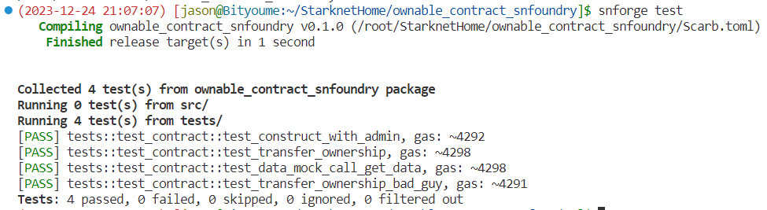
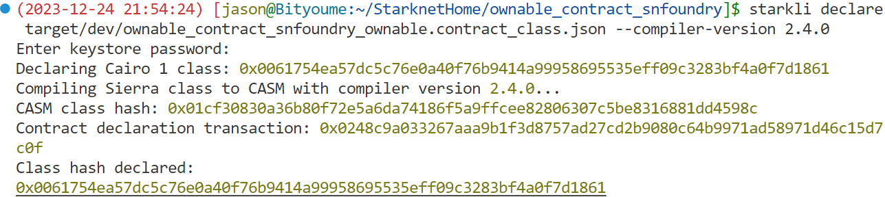
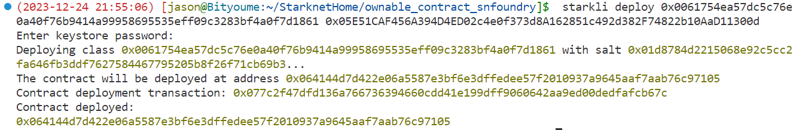
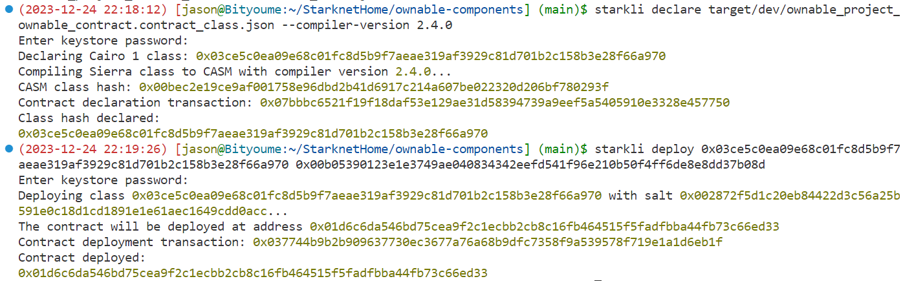
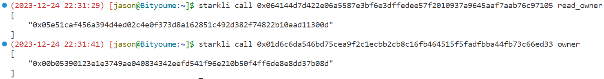
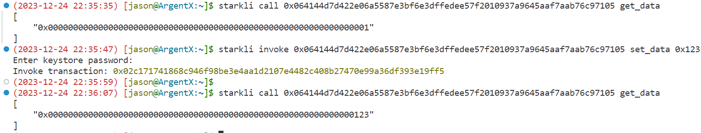
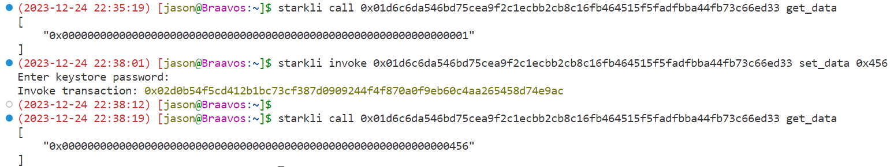
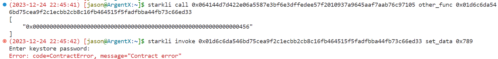
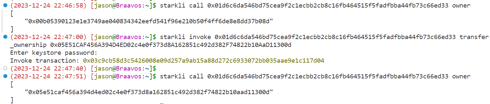
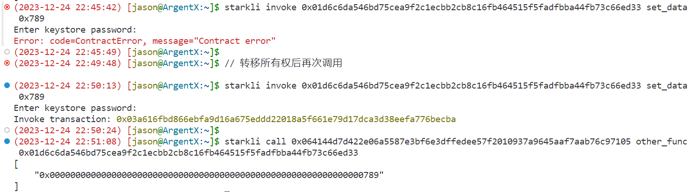

# OpenBuild Starknet Bootcamp任务3：Starknet Foundry合约测试代码错误修复及部署和交互测试

## 1 任务要求

1. 基于 [Ownable contract with SnFoundry](https://github.com/gianalarcon/Ownable-contract-snFoundry)， 在 **tests/test_ownable.cairo** 文件上完成测试。当前包含一个老版本的测试，需要升级到 v0.12.0 or v0.13.0并修复错误，所有的测试必须通过 `snforge test` ，你可参考 [Voting contract](https://github.com/gianalarcon/vote-contract) ，也可查看[snfoundry-book](https://foundry-rs.github.io/starknet-foundry/index.html)。
2. 部署到测试，并与 [Ownable components](https://github.com/gianalarcon/ownable-components) 合约交互

## 2 工具安装

- **scarb**

```bash
# 安装插件
$ asdf plugin add scarb

# 查看所有可安装版本
$ asdf list-all scarb
......
0.7.0
2.3.0
2.3.1
2.4.0
2.4.1

# 安装指定版本
$ asdf install scarb 2.4.1

# 全局使用版本
$ asdf global scarb 2.4.1

# 查看版本号
$ scarb --version
scarb 2.4.1 (c93ee6249 2023-12-21)
cairo: 2.4.1 (https://crates.io/crates/cairo-lang-compiler/2.4.1)
sierra: 1.4.0
```

- **snforge**

```bash
# 安装插件
$ asdf plugin add starknet-foundry

# 查看所有可安装版本
$ asdf list-all starknet-foundry
......
0.10.2
0.11.0
0.12.0
0.13.0
0.13.1

# 安装指定版本
$ asdf install starknet-foundry 0.13.1

# 全局使用版本
$ asdf global starknet-foundry 0.13.1

# 查看版本号
$ snforge --version
snforge 0.13.1

$ sncast --version
sncast 0.13.1
```

## 3 项目创建及错误修复

### 3.1 创建项目

```bash
# 项目初始化
$ snforge init ownable_contract_snfoundry
Created `ownable_contract_snfoundry` package.

# 编译
$ scarb build
   Compiling ownable_contract_snfoundry v0.1.0 (/root/StarknetHome/ownable_contract_snfoundry/Scarb.toml)
    Finished release target(s) in 1 second
    
# 测试
$ snforge test
   Compiling ownable_contract_snfoundry v0.1.0 (/root/StarknetHome/ownable_contract_snfoundry/Scarb.toml)
    Finished release target(s) in 1 second
Collected 2 test(s) from ownable_contract_snfoundry package
Running 0 test(s) from src/
Running 2 test(s) from tests/
[PASS] tests::test_contract::test_cannot_increase_balance_with_zero_value, gas: ~1842
[PASS] tests::test_contract::test_increase_balance, gas: ~3068
Tests: 2 passed, 0 failed, 0 skipped, 0 ignored, 0 filtered out
```

- `Scarb.toml`文件内容为

```toml
[package]
name = "ownable_contract_snfoundry"
version = "0.1.0"
edition = "2023_10"

# See more keys and their definitions at https://docs.swmansion.com/scarb/docs/reference/manifest.html

[dependencies]
snforge_std = { git = "https://github.com/foundry-rs/starknet-foundry", tag = "v0.13.1" }
starknet = "2.4.1"

[[target.starknet-contract]]
casm = true
```

### 3.2 拷贝合约和测试文件

- 将`src/lib.cairo`中的代码替换为：https://github.com/gianalarcon/Ownable-contract-snFoundry/blob/main/src/lib.cairo

```rust
use core::traits::TryInto;
use starknet::ContractAddress;

#[starknet::interface]
trait IData<T> {
    fn get_data(self: @T) -> felt252;
    fn set_data(ref self: T, new_value: felt252);
    fn other_func(self: @T, other_contract: ContractAddress) -> felt252;
}

#[starknet::interface]
trait OwnableTrait<T> {
    fn transfer_ownership(ref self: T, new_owner: ContractAddress);
    fn read_owner(self: @T) -> ContractAddress;
}

#[starknet::contract]
mod ownable {
    use starknet::get_caller_address;
    use super::{ContractAddress, IData, IDataDispatcherTrait, IDataDispatcher, OwnableTrait};

    #[storage]
    struct Storage {
        owner: ContractAddress,
        data: felt252,
    }

    #[event]
    #[derive(Drop, starknet::Event)]
    enum Event {
        OwnershipTransferred: OwnershipTransferred,
    }

    #[derive(Drop, starknet::Event)]
    struct OwnershipTransferred {
        #[key]
        prev_owner: ContractAddress,
        #[key]
        new_owner: ContractAddress,
    }

    #[constructor]
    fn constructor(ref self: ContractState, initial_owner: ContractAddress) {
        self.owner.write(initial_owner);
        self.data.write(1);
    // Any variable of the storage that is not initialized
    // will have default value -> data = 0.
    }

    #[external(v0)]
    impl OwnableDataImpl of IData<ContractState> {
        fn other_func(self: @ContractState, other_contract: ContractAddress) -> felt252 {
            IDataDispatcher { contract_address: other_contract }.get_data()
        }

        fn get_data(self: @ContractState) -> felt252 {
            self.data.read()
        }

        fn set_data(ref self: ContractState, new_value: felt252) {
            self.only_owner();
            self.data.write(new_value);
        }
    }

    #[external(v0)]
    impl OwnableTraitImpl of OwnableTrait<ContractState> {
        fn transfer_ownership(ref self: ContractState, new_owner: ContractAddress) {
            self.only_owner();
            let prev_owner = self.owner.read();
            self.owner.write(new_owner);

            self.emit(OwnershipTransferred { prev_owner, new_owner });
        }

        fn read_owner(self: @ContractState) -> ContractAddress {
            self.owner.read()
        }
    }

    #[generate_trait]
    impl PrivateMethods of PrivateMethodsTrait {
        fn only_owner(self: @ContractState) {
            let caller = get_caller_address();
            assert(caller == self.owner.read(), 'Caller is not the owner');
        }
    }
}
```

- 将`tests/test_contract.cairo`测试文件内容替换为：https://github.com/gianalarcon/Ownable-contract-snFoundry/blob/main/tests/test_ownable.cairo

```bash
// This test were working with snFoundry version v0.7.0. You task is to enable this tests using snFoundry version v0.12.0 or v0.13.0
use starknet::{ContractAddress, Into, TryInto, OptionTrait};
use starknet::syscalls::deploy_syscall;
use result::ResultTrait;
use array::{ArrayTrait, SpanTrait};
use snforge_std::{declare, ContractClassTrait};
use snforge_std::io::{FileTrait, read_txt};
use snforge_std::{start_prank, stop_prank};
use snforge_std::{start_mock_call, stop_mock_call};

use ownable_starknet::{OwnableTraitDispatcher, OwnableTraitDispatcherTrait};
use ownable_starknet::{IDataSafeDispatcher, IDataSafeDispatcherTrait};

mod Errors {
    const INVALID_OWNER: felt252 = 'Caller is not the owner';
    const INVALID_DATA: felt252 = 'Invalid data';
}

mod Accounts {
    use traits::TryInto;
    use starknet::ContractAddress;

    fn admin() -> ContractAddress {
        'admin'.try_into().unwrap()
    }
    fn new_admin() -> ContractAddress {
        'new_admin'.try_into().unwrap()
    }
    fn bad_guy() -> ContractAddress {
        'bad_guy'.try_into().unwrap()
    }
}

fn deploy_contract(name: felt252) -> ContractAddress {
    // let account = Accounts::admin();
    let contract = declare(name);

    let file = FileTrait::new('data/calldata.txt');
    let calldata = read_txt(@file);
    //deploy contract
    contract.deploy(@calldata).unwrap()
}

#[test]
fn test_construct_with_admin() {
    let contract_address = deploy_contract('ownable');
    let dispatcher = OwnableTraitDispatcher { contract_address };
    let owner = dispatcher.read_owner();
    assert(owner == Accounts::admin(), Errors::INVALID_OWNER);
}

#[test]
fn test_transfer_ownership() {
    let contract_address = deploy_contract('ownable');
    let dispatcher = OwnableTraitDispatcher { contract_address };
    start_prank(contract_address, Accounts::admin());
    dispatcher.transfer_ownership(Accounts::new_admin());

    assert(dispatcher.read_owner() == Accounts::new_admin(), Errors::INVALID_OWNER);
}

#[test]
#[should_panic(expected: ('Caller is not the owner',))]
fn test_transfer_ownership_bad_guy() {
    let contract_address = deploy_contract('ownable');
    let dispatcher = OwnableTraitDispatcher { contract_address };
    start_prank(contract_address, Accounts::bad_guy());
    dispatcher.transfer_ownership(Accounts::bad_guy());

    assert(dispatcher.read_owner() == Accounts::bad_guy(), Errors::INVALID_OWNER);
}

#[test]
fn test_data_mock_call_get_data() {
    let contract_address = deploy_contract('ownable');
    let safe_dispatcher = IDataSafeDispatcher { contract_address };
    let mock_ret_data = 100;
    start_mock_call(contract_address, 'get_data', mock_ret_data);
    start_prank(contract_address, Accounts::admin());
    safe_dispatcher.set_data(20);
    let data = safe_dispatcher.get_data().unwrap();
    assert(data == mock_ret_data, Errors::INVALID_DATA);
    stop_mock_call(contract_address, 'get_data');

    let data2 = safe_dispatcher.get_data().unwrap();
    assert(data2 == 20, Errors::INVALID_DATA);
    stop_prank(contract_address);
}
```

### 3.3 修改测试文件错误

#### （1）错误1：引用包路径错误

```rust
// 修改前
use snforge_std::io::{FileTrait, read_txt};

// 修改后
use snforge_std::fs::{FileTrait, read_txt};
```

#### （2）错误2：参数类型错误

```rust
// 修改前
// Unexpected argument type. Expected: "snforge_std::cheatcodes::CheatTarget", found: "core::starknet::contract_address::ContractAddress".
start_prank(contract_address, Accounts::admin());

// 修改后
// use snforge_std::{start_prank, stop_prank, cheatcodes::CheatTarget};
start_prank(CheatTarget::One(contract_address), Accounts::admin());
```

### 3.4 测试用例执行验证

```
$ snforge test
```



## 4 测试网部署

### 4.1 部署[ownable_contract_snfoundry](https://github.com/bityoume/OpenBuildStarknet/tree/main/ownable_contract_snfoundry)合约

> 使用`Argent`账号进行部署，关于钱包创建方法参看：https://learnblockchain.cn/article/7093

#### （1）声明合约

```bash
$ . .env_a 

$ starkli declare target/dev/ownable_contract_snfoundry_ownable.contract_class.json --compiler-version 2.4.0

Enter keystore password: 
Declaring Cairo 1 class: 0x0061754ea57dc5c76e0a40f76b9414a99958695535eff09c3283bf4a0f7d1861
Compiling Sierra class to CASM with compiler version 2.4.0...
CASM class hash: 0x01cf30830a36b80f72e5a6da74186f5a9ffcee82806307c5be8316881dd4598c
Contract declaration transaction: 0x0248c9a033267aaa9b1f3d8757ad27cd2b9080c64b9971ad58971d46c15d7c0f
Class hash declared:
0x0061754ea57dc5c76e0a40f76b9414a99958695535eff09c3283bf4a0f7d1861
```



#### （2）部署合约

```bash
$  starkli deploy 0x0061754ea57dc5c76e0a40f76b9414a99958695535eff09c3283bf4a0f7d1861 0x05E51CAF456A394D4ED02c4e0f373d8A162851c492d382F74822b10AaD11300d

Enter keystore password: 
Deploying class 0x0061754ea57dc5c76e0a40f76b9414a99958695535eff09c3283bf4a0f7d1861 with salt 0x01d8784d2215068e92c5cc2fa646fb3ddf7627584467795205b8f26f71cb69b3...
The contract will be deployed at address 0x064144d7d422e06a5587e3bf6e3dffedee57f2010937a9645aaf7aab76c97105
Contract deployment transaction: 0x077c2f47dfd136a766736394660cdd41e199dff9060642aa9ed00dedfafcb67c
Contract deployed:
0x064144d7d422e06a5587e3bf6e3dffedee57f2010937a9645aaf7aab76c97105
```



### 4.2 部署[Ownable components](https://github.com/gianalarcon/ownable-components)合约

> 使用`Braavos`账号部署

```bash
$ git clone git@github.com:gianalarcon/ownable-components.git

$ cd ownable-components

$ source .env_b 

$ scarb build
   Compiling ownable_project v0.1.0 (/root/StarknetHome/ownable-components/Scarb.toml)
    Finished release target(s) in 1 second
    
$ starkli declare target/dev/ownable_project_ownable_contract.contract_class.json --compiler-version 2.4.0
Enter keystore password: 
Declaring Cairo 1 class: 0x03ce5c0ea09e68c01fc8d5b9f7aeae319af3929c81d701b2c158b3e28f66a970
Compiling Sierra class to CASM with compiler version 2.4.0...
CASM class hash: 0x00bec2e19ce9af001758e96dbd2b41d6917c214a607be022320d206bf780293f
Contract declaration transaction: 0x07bbbc6521f19f18daf53e129ae31d58394739a9eef5a5405910e3328e457750
Class hash declared:
0x03ce5c0ea09e68c01fc8d5b9f7aeae319af3929c81d701b2c158b3e28f66a970

$ starkli deploy 0x03ce5c0ea09e68c01fc8d5b9f7aeae319af3929c81d701b2c158b3e28f66a970 0x00b05390123e1e3749ae040834342eefd541f96e210b50f4ff6de8e8dd37b08d
Enter keystore password: 
Deploying class 0x03ce5c0ea09e68c01fc8d5b9f7aeae319af3929c81d701b2c158b3e28f66a970 with salt 0x002872f5d1c20eb84422d3c56a25b591e0c18d1cd1891e1e61aec1649cdd0acc...
The contract will be deployed at address 0x01d6c6da546bd75cea9f2c1ecbb2cb8c16fb464515f5fadfbba44fb73c66ed33
Contract deployment transaction: 0x037744b9b2b909637730ec3677a76a68b9dfc7358f9a539578f719e1a1d6eb1f
Contract deployed:
0x01d6c6da546bd75cea9f2c1ecbb2cb8c16fb464515f5fadfbba44fb73c66ed33
```



### 4.3 部署信息汇总

| 钱包类型 | 部署钱包地址                                                 | 部署合约地址                                                 | 部署合约代码                                                 |
| -------- | ------------------------------------------------------------ | ------------------------------------------------------------ | ------------------------------------------------------------ |
| Argent   | 0x05E51CAF456A394D4ED02c4e0f373d8A162851c492d382F74822b10AaD11300d | 0x064144d7d422e06a5587e3bf6e3dffedee57f2010937a9645aaf7aab76c97105 | [ownable_contract_snfoundry](https://github.com/bityoume/OpenBuildStarknet/tree/main/ownable_contract_snfoundry) |
| Braavos  | 0x00b05390123e1e3749ae040834342eefd541f96e210b50f4ff6de8e8dd37b08d | 0x01d6c6da546bd75cea9f2c1ecbb2cb8c16fb464515f5fadfbba44fb73c66ed33 | [Ownable components](https://github.com/gianalarcon/ownable-components) |

## 5 合约交互测试

### 5.1 获取钱包所有者

```bash
$ starkli call 0x064144d7d422e06a5587e3bf6e3dffedee57f2010937a9645aaf7aab76c97105 read_owner
[
    "0x05e51caf456a394d4ed02c4e0f373d8a162851c492d382f74822b10aad11300d"
]

$ starkli call 0x01d6c6da546bd75cea9f2c1ecbb2cb8c16fb464515f5fadfbba44fb73c66ed33 owner
[
    "0x00b05390123e1e3749ae040834342eefd541f96e210b50f4ff6de8e8dd37b08d"
]
```



### 5.2 ArgentX帐号成功修改自己的数据

```bash
$ starkli call 0x064144d7d422e06a5587e3bf6e3dffedee57f2010937a9645aaf7aab76c97105 get_data
[
    "0x0000000000000000000000000000000000000000000000000000000000000001"
]

$ starkli invoke 0x064144d7d422e06a5587e3bf6e3dffedee57f2010937a9645aaf7aab76c97105 set_data 0x123
Enter keystore password: 
Invoke transaction: 0x02c171741868c946f98be3e4aa1d2107e4482c408b27470e99a36df393e19ff5

$ starkli call 0x064144d7d422e06a5587e3bf6e3dffedee57f2010937a9645aaf7aab76c97105 get_data
[
    "0x0000000000000000000000000000000000000000000000000000000000000123"
]
```



### 5.3 Braavos帐号成功修改自己的数据

```bash
$ starkli call 0x01d6c6da546bd75cea9f2c1ecbb2cb8c16fb464515f5fadfbba44fb73c66ed33 get_data
[
    "0x0000000000000000000000000000000000000000000000000000000000000001"
]

$ starkli invoke 0x01d6c6da546bd75cea9f2c1ecbb2cb8c16fb464515f5fadfbba44fb73c66ed33 set_data 0x456
Enter keystore password: 
Invoke transaction: 0x02d0b54f5cd412b1bc73cf387d0909244f4f870a0f9eb60c4aa265458d74e9ac

$ starkli call 0x01d6c6da546bd75cea9f2c1ecbb2cb8c16fb464515f5fadfbba44fb73c66ed33 get_data
[
    "0x0000000000000000000000000000000000000000000000000000000000000456"
]
```



### 5.4 ArgentX帐号修改Braavos帐号创建的合约数据失败

```bash
$ starkli call 0x064144d7d422e06a5587e3bf6e3dffedee57f2010937a9645aaf7aab76c97105 other_func 0x01d6c6da546bd75cea9f2c1ecbb2cb8c16fb464515f5fadfbba44fb73c66ed33
[
    "0x0000000000000000000000000000000000000000000000000000000000000456"
]

$ starkli invoke 0x01d6c6da546bd75cea9f2c1ecbb2cb8c16fb464515f5fadfbba44fb73c66ed33 set_data 0x789
Enter keystore password: 
Error: code=ContractError, message="Contract error"
```



### 5.5 Braavos帐号将合约所有权转移给ArgentX帐号

```bash
# 转移前帐号归属
$ starkli call 0x01d6c6da546bd75cea9f2c1ecbb2cb8c16fb464515f5fadfbba44fb73c66ed33 owner
[
    "0x00b05390123e1e3749ae040834342eefd541f96e210b50f4ff6de8e8dd37b08d"
]

# 转移帐号所有权
$ starkli invoke 0x01d6c6da546bd75cea9f2c1ecbb2cb8c16fb464515f5fadfbba44fb73c66ed33 transfer_ownership 0x05E51CAF456A394D4ED02c4e0f373d8A162851c492d382F74822b10AaD11300d
Enter keystore password: 
Invoke transaction: 0x03c9cb58d3c5426008e09d257a9ab15a88d272c6933072bb035aae9e1c117d04

# 转移后帐号归属
$ starkli call 0x01d6c6da546bd75cea9f2c1ecbb2cb8c16fb464515f5fadfbba44fb73c66ed33 owner
[
    "0x05e51caf456a394d4ed02c4e0f373d8a162851c492d382f74822b10aad11300d"
]
```



### 5.6 ArgentX帐号再次修改帐号Braavos的合约数据成功

```bash
$ starkli invoke 0x01d6c6da546bd75cea9f2c1ecbb2cb8c16fb464515f5fadfbba44fb73c66ed33 set_data 0x789
Enter keystore password: 
Invoke transaction: 0x05d96084aa237aceab74030ce187e4ccc1d97fb7f62fc6d3c3dd447ab9aeb8f6

$ starkli call 0x064144d7d422e06a5587e3bf6e3dffedee57f2010937a9645aaf7aab76c97105 other_func 0x01d6c6da546bd75cea9f2c1ecbb2cb8c16fb464515f5fadfbba44fb73c66ed33
[
    "0x0000000000000000000000000000000000000000000000000000000000000456"
]
```

